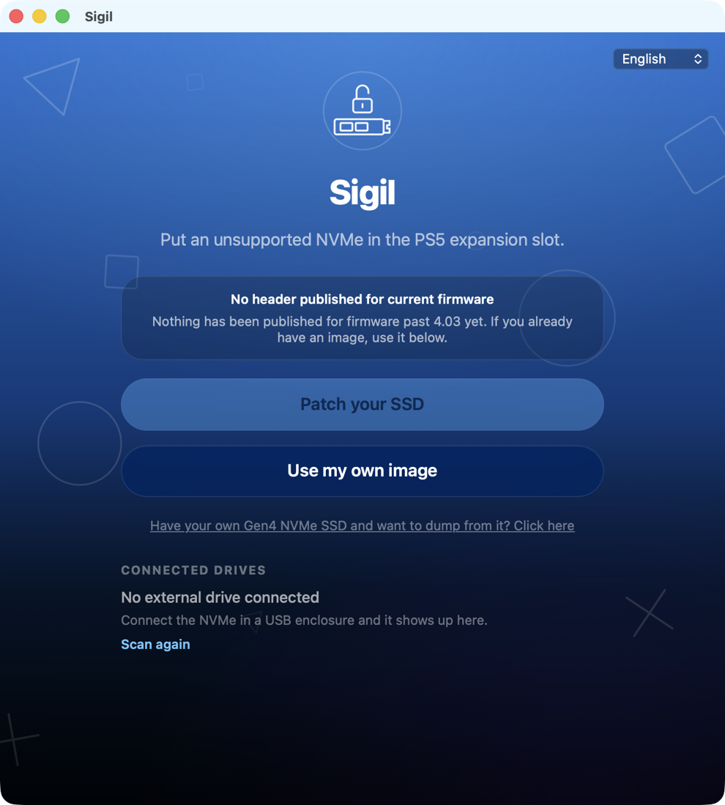

# Sigil

Capture and transplant PS5 extended storage partition headers, with guard rails
so nobody has to point `dd` at the wrong disk. Windows, macOS and Linux.



> **Status: experimental, and currently blocked.** The technique this tool
> automates is known to have worked on PS5 firmware 4.03, but the extended
> storage partition layout changed on later firmware and no sample of the
> current layout is publicly available. See [Current blocker](#current-blocker).

## What this is about

The PS5 M.2 expansion slot requires a PCIe Gen4 drive with at least 5,500 MB/s
sequential read. A Gen3 x4 drive tops out around 3.5 GB/s — below the floor by
bus bandwidth, not by labelling, so no firmware trick makes a Gen3 drive
negotiate as Gen4.

What *was* demonstrated is different: the console appears to run its speed
validation at **format** time, not at **mount** time. Presented with a volume
that already carries a valid extended storage layout, it mounts the drive
without ever benchmarking it.

In 2022 this was reached by accident. Windfox found that writing the
NetflixNHack extended storage image onto a Gen3 M.2 got the console to accept
the drive instead of refusing it; flaviopenas-ps then trimmed that image into
something small and quick to flash. Bringus Studios mounted a 128 GB drive the
same way, so the 250 GB floor was not enforced either. No exploit and no
jailbreak are involved — this runs on stock firmware.

## Current blocker

The extended storage partition layout changed on newer firmware, so images
built for 4.03 are no longer recognized. Rebuilding one requires a sample of
the current layout: a read-only dump of the leading sectors from a Gen4 NVMe
SSD that is already formatted and working in a PS5 on current firmware.

Two open questions determine whether the approach survives at all:

- **Does the header carry console-unique data?** If the layout is bound to the
  console that formatted it, a shared dump is useless.
- **Does drive capacity have to match?** DrYenyen's drive cloning research
  notes that PS5 M.2 extended storage needs exact-size images, unlike PS4
  extended storage. If that applies here, a donor has to match the target's
  capacity rather than being any Gen4 drive.

**If you have a Gen4 NVMe SSD working in a PS5 and are willing to contribute a
read-only header dump, open an issue.** Sigil does it in two clicks and writes
nothing to your drive; installed games are untouched.

## What the app does

- Enumerates removable external drives and refuses to touch boot or internal
  media. Each platform filters at the source and the result is checked again
  before it reaches the interface.
- Fetches published headers from this repository and verifies every download
  against its `sha256` before it can be written.
- Falls back to an image file you supply when GitHub is unreachable, or when
  nothing is published for your firmware yet.
- Captures a read-only header from a donor drive and opens a pre-addressed
  draft in your own mail client. It ships no credentials and sends nothing by
  itself.
- Puts every write behind the operating system's own elevation prompt. The
  password is typed into a dialog the OS puts up; the app never sees it.

## Safety

Writing to a block device is destructive and not undoable. The app will not
offer internal or boot volumes as targets, and every write is confirmed against
a named destination. Even so: verify the disk identifier yourself before
confirming, and do not run this against a drive holding anything you care about.

## Install

Grab the build for your system from the
[releases page](https://github.com/NspxMiguel/sigil/releases):

| System | File |
| --- | --- |
| Windows | `.msi` installer |
| macOS | `.dmg` |
| Linux | `.AppImage` or `.deb` |

The macOS build is signed ad-hoc rather than with a paid Developer ID, so
Gatekeeper asks once on first launch: right-click the app and choose Open.

## Build from source

Needs [Rust](https://rustup.rs) and [Bun](https://bun.sh).

```bash
git clone https://github.com/NspxMiguel/sigil.git
cd sigil
bun install
bun run tauri build
```

`bun run tauri dev` runs it with the web inspector attached.

Linux also needs the WebKitGTK development packages:

```bash
sudo apt install libwebkit2gtk-4.1-dev libappindicator3-dev librsvg2-dev patchelf
```

## Credits

The original technique is not ours. Windfox found the behaviour,
flaviopenas-ps produced the practical trimmed image, and Bringus Studios
established that the capacity floor was not enforced. This repository exists so
that work is in one place instead of scattered across a Discord and a handful
of forum threads.

## License

MIT © 2026 NSPX
